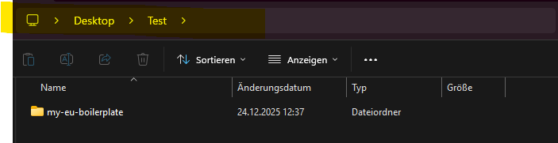

This is a [Next.js](https://nextjs.org) project bootstrapped with [`create-next-app`](https://nextjs.org/docs/app/api-reference/cli/create-next-app).

## Getting Started

First, go to your Windows Explorer and create a new Folder, whereever you want it.

Then go to my GitHub and press on the green button "<> Code" and copy the HTTPS link. 
Now go to your newly created folder and click on your path.



Here you can enter the CLI by typing cmd and pressing ENTER.

After opening your CLI, you type "git clone LINK" and enter the HTTPS-Link you just copied and press ENTER. After a few seconds of downloading my repository, just type code . and Visual Studio Code will open itself.
If you made it so far, you have to open another CLI in VSC and navigate to my project folder with and install the needed instances
```bash
cd my-eu-boilerplate
npm install
```

The databank needs specific authorizations, thats why you should enable the Developer Mode in Windows. You do that by entering "Developer Mode" in your Windows search function and scroll down until you see "Developer Mode" and just activate it.

Once you are down you have to manually create a .env File in your root folder (the path should be: "my-eu-boilerplate/.env).

Into this file you copy:

```
NEXTAUTH_URL=http://localhost:3000
NEXTAUTH_SECRET=randomAmountOfSignsButAtleast32=
```

Afterwards you can start your program with 
```
npm run dev
```

go to localhost:3000 and login.